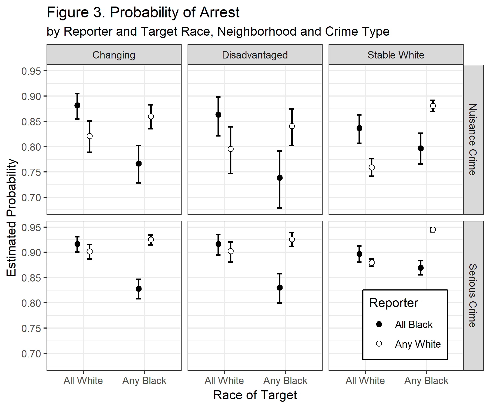

```{r setup, include=FALSE}
options(htmltools.dir.version = FALSE)
knitr::opts_chunk$set(comment = "##")
```

```{r xaringan-themer, include=FALSE}
library(xaringanthemer)
source("./syntax/csss508css.R")
```

class: inverse

# Setup and Data


---
# Gapminder Data

We'll be working with data from Hans Rosling's [Gapminder](http://www.gapminder.org) project.
An excerpt of these data can be accessed through an R package called `gapminder`, cleaned and assembled by Jenny Bryan at UBC.

--

In the console: `install.packages("gapminder")`

Load the package and data:
```{r}
library(gapminder)
```

---

# Check Out Gapminder

The data frame we will work with is called `gapminder`, available once you have loaded the package. Let's see its structure:

.small[
```{r}
str(gapminder)
```
]

---

# What's Interesting Here?

* **Factor** variables `country` and `continent`

   + Factors are categorical data with an underlying numeric representation
   + We'll spend a lot of time on factors later!

--

* Many observations: $n=`r nrow(gapminder)`$ rows

--

* A nested/hierarchical structure: `year` in `country` in `continent`

   + These are panel data!

---

# Installing Tidyverse

We'll want to be able to slice up this data frame into subsets (e.g. just the rows for Afghanistan, just the rows for 1997).

We will use a package called `dplyr` to do this neatly. If you're unfamiliar, see my [previous workshop](https://clanfear.github.io/Intermediate_R_Workshop/)!

`dplyr` is part of the [tidyverse](http://tidyverse.org/) family of R packages.

--

If you have not already installed the tidyverse, type, in the console: `install.packages("tidyverse")`

--

This will install a *large* number of R packages we will use throughout the term, including `dplyr` and `ggplot2`.

`dplyr` is a very useful and powerful package that we will talk more about soon, but today we're mostly going to use it for subsetting data.

---
# Subsetting Example

For some examples to follow, I'd like to subset down only to data in China.

```{r, message=FALSE}
library(dplyr)
China <- gapminder %>%
  filter(country == "China")
head(China)
```

.footnote[If anything done here is unclear, let me know!]
---
class: inverse

# `ggplot2`

.center[

]

---

## Base R Plots

.pull-left[
 .small[
```{r, eval=FALSE}
plot(lifeExp ~ year, 
     data = China, 
     xlab = "Year", 
     ylab = "Life expectancy",
     main = "Life expectancy in China", 
     col = "red", 
     cex.lab = 1.5,
     cex.main= 1.5,
     pch = 16)
```
 ]
]

.pull-right[
```{r, echo=FALSE}
plot(lifeExp ~ year, 
     data = China, 
     xlab = "Year", 
     ylab = "Life expectancy",
     main = "Life expectancy in China", 
     col = "red", 
     cex.lab = 1.5,
     cex.main= 1.5,
     pch = 16)
```
]

---
# `ggplot2`

An alternative way of plotting many prefer (myself included)<sup>1</sup> uses the `ggplot2` package in R, which is part of the `tidyverse`.

.footnote[[1] [Though this is not without debate](http://simplystatistics.org/2016/02/11/why-i-dont-use-ggplot2/)]

```{r}
library(ggplot2)
```

The core idea underlying this package is the [**layered grammar of graphics**](https://doi.org/10.1198/jcgs.2009.07098): we can break up elements of a plot into pieces and combine them.

---
## Chinese Life Expectancy in `ggplot`

.pull-left[
 .small[
```{r,  eval=FALSE}
ggplot(data = China, 
       aes(x = year, y = lifeExp)) +
  geom_point(color = "red", size = 3) +
  xlab("Year") + 
  ylab("Life expectancy") +
  ggtitle("Life expectancy in China") +
  theme_bw(base_size=18) #<<
```
]
]

.pull-right[
```{r,  dev='svg', echo=FALSE}
ggplot(data = China, 
       aes(x = year, y = lifeExp)) +
  geom_point(color = "red", size = 3) +
  xlab("Year") + 
  ylab("Life expectancy") +
  ggtitle("Life expectancy in China") +
  theme_bw(base_size=18) #<<
```
]

---
# Structure of a ggplot

`ggplot2` graphics objects consist of two primary components:

--

1. **Layers**, the components of a graph.

   * We *add* layers to a `ggplot2` object using `+`.
   * This includes lines, shapes, and text.

--

2. **Aesthetics**, which determine how the layers appear.

   * We *set* aesthetics using *arguments* (e.g. `color="red"`) inside layer functions.
   * This includes locations, colors, and sizes.
   * Aesthetics also determine how data *map* to appearances.

---

# Layers

**Layers** are the components of the graph, such as:

* `ggplot()`: initializes `ggplot2` object, specifies input data
* `geom_point()`: layer of scatterplot points
* `geom_line()`: layer of lines
* `ggtitle()`, `xlab()`, `ylab()`: layers of labels
* `facet_wrap()`: layer creating separate panels stratified by some factor wrapping around
* `facet_grid()`: same idea, but can split by two variables along rows and columns (e.g. `facet_grid(gender ~ age_group)`)
* `theme_bw()`: replace default gray background with black-and-white

Layers are separated by a `+` sign. For clarity, I usually put each layer on a new line, unless it takes few or no arguments (e.g. `xlab()`, `ylab()`, `theme_bw()`).

---

# Aesthetics

**Aesthetics** control the appearance of the layers:

* `x`, `y`: $x$ and $y$ coordinate values to use
* `color`: set color of elements based on some data value
* `group`: describe which points are conceptually grouped together for the plot (often used with lines)
* `size`: set size of points/lines based on some data value
* `alpha`: set transparency based on some data value

---

## Aesthetics: Setting vs. mapping

Layers take arguments to control their appearance, such as point/line colors or transparency (`alpha` between 0 and 1).

--

* Arguments like `color`, `size`, `linetype`, `shape`, `fill`, and `alpha` can be used directly on the layers (**setting aesthetics**), e.g. `geom_point(color = "red")`. See the [`ggplot2` documentation](http://docs.ggplot2.org/current/vignettes/ggplot2-specs.html) for options. These *don't depend on the data*.

--

* Arguments inside `aes()` (**mapping aesthetics**) will *depend on the data*, e.g. `geom_point(aes(color = continent))`.

--

* `aes()` in the `ggplot()` layer gives overall aesthetics to use in other layers, but can be changed on individual layers (including switching `x` or `y` to different variables)

--

This may seem pedantic, but precise language makes searching for help easier.

--

Now let's see all this jargon in action.

---
## Axis Labels, Points, No Background

### 1: Base Plot

.pull-left[
 .small[
```{r, fig.height=4, dev='svg', eval=FALSE}
ggplot(data = China,  #<<
       aes(x = year, y = lifeExp)) #<<
```
]
]
.pull-right[
```{r, dev='svg', echo=FALSE}
ggplot(data = China,  
       aes(x = year, y = lifeExp)) 
```
]

.footnote[We initialize the plot with `ggplot()` and an aesthetic.]

---
count: false

## Axis Labels, Points, No Background

### 2: Scatterplot

.pull-left[
 .small[
```{r, fig.height=4, dev='svg', eval=FALSE}
ggplot(data = China, 
       aes(x = year, y = lifeExp)) +
  geom_point() #<<
```
]
]
.pull-right[
```{r,  dev='svg', echo=FALSE}
ggplot(data = China, 
       aes(x = year, y = lifeExp)) +
  geom_point() 
```
]

.footnote[Add a scatterplot.]
---
count: false

## Axis Labels, Points, No Background

### 3: Point Color and Size

.pull-left[
 .small[
```{r, fig.height=4, dev='svg', eval=FALSE}
ggplot(data = China, 
       aes(x = year, y = lifeExp)) +
  geom_point(color = "red", size = 3) #<<
```
]
]
.pull-right[
```{r,  dev='svg', echo=FALSE}
ggplot(data = China, 
       aes(x = year, y = lifeExp)) +
  geom_point(color = "red", size = 3) 
```
]

.footnote[Make the points large and red.]
---
count: false

## Axis Labels, Points, No Background

### 4: X-Axis Label

.pull-left[
 .small[
```{r, fig.height=4, dev='svg', eval=FALSE}
ggplot(data = China, 
       aes(x = year, y = lifeExp)) +
  geom_point(color = "red", size = 3) +
  xlab("Year") #<<
```
]
]
.pull-right[
```{r,  dev='svg', echo=FALSE}
ggplot(data = China, 
       aes(x = year, y = lifeExp)) +
  geom_point(color = "red", size = 3) +
  xlab("Year") 
```
]

.footnote[Capitalize the x-axis label.]
---
count: false

## Axis Labels, Points, No Background

### 5: Y-Axis Label

.pull-left[
 .small[
```{r, fig.height=4, dev='svg', eval=FALSE}
ggplot(data = China, 
       aes(x = year, y = lifeExp)) +
  geom_point(color = "red", size = 3) +
  xlab("Year") + 
  ylab("Life expectancy") #<<
```
]
]
.pull-right[
```{r,  dev='svg', echo=FALSE}
ggplot(data = China, 
       aes(x = year, y = lifeExp)) +
  geom_point(color = "red", size = 3) +
  xlab("Year") + 
  ylab("Life expectancy")
```
]

.footnote[Clean up the y-axis label.]
---
count: false

## Axis Labels, Points, No Background

### 6: Title

.pull-left[
 .small[
```{r, fig.height=4, dev='svg', eval=FALSE}
ggplot(data = China, 
       aes(x = year, y = lifeExp)) +
  geom_point(color = "red", size = 3) +
  xlab("Year") + 
  ylab("Life expectancy") +
  ggtitle("Life expectancy in China") #<<
```
]
]
.pull-right[
```{r,  dev='svg', echo=FALSE}
ggplot(data = China, 
       aes(x = year, y = lifeExp)) +
  geom_point(color = "red", size = 3) +
  xlab("Year") + 
  ylab("Life expectancy") +
  ggtitle("Life expectancy in China")
```
]

.footnote[Add a title.]
---
count: false

## Axis Labels, Points, No Background

### 7: Theme

.pull-left[
 .small[
```{r, fig.height=4, dev='svg', eval=FALSE}
ggplot(data = China, 
       aes(x = year, y = lifeExp)) +
  geom_point(color = "red", size = 3) +
  xlab("Year") + 
  ylab("Life expectancy") +
  ggtitle("Life expectancy in China") +
  theme_bw() #<<
```
]
]
.pull-right[
```{r,  dev='svg', echo=FALSE}
ggplot(data = China, 
       aes(x = year, y = lifeExp)) +
  geom_point(color = "red", size = 3) +
  xlab("Year") + 
  ylab("Life expectancy") +
  ggtitle("Life expectancy in China") +
  theme_bw() #<<
```
]

.footnote[Pick a nicer theme.]
---
count: false

## Axis Labels, Points, No Background

### 8: Text Size

.pull-left[
 .small[
```{r, fig.height=4, dev='svg', eval=FALSE}
ggplot(data = China, 
       aes(x = year, y = lifeExp)) +
  geom_point(color = "red", size = 3) +
  xlab("Year") + 
  ylab("Life expectancy") +
  ggtitle("Life expectancy in China") +
  theme_bw(base_size=18) #<<
```
]
]
.pull-right[
```{r,  dev='svg', echo=FALSE}
ggplot(data = China, 
       aes(x = year, y = lifeExp)) +
  geom_point(color = "red", size = 3) +
  xlab("Year") + 
  ylab("Life expectancy") +
  ggtitle("Life expectancy in China") +
  theme_bw(base_size=18) #<<
```
]

.footnote[Increase the base text size.]
---
# Plotting All Countries

We have a plot we like for China... 

... but what if we want *all the countries*?

---
count: false

# Plotting All Countries

### 1: A Mess!
.pull-left[
 .small[
```{r, fig.height=4, dev='svg', eval=FALSE}
ggplot(data = gapminder,#<<
       aes(x = year, y = lifeExp)) +
  geom_point(color = "red", size = 3) +
  xlab("Year") + 
  ylab("Life expectancy") +
  ggtitle("Life expectancy over time") +
  theme_bw(base_size=18)
```
]
]
.pull-right[
```{r,  dev='svg', echo=FALSE}
ggplot(data = gapminder, #<<
       aes(x = year, y = lifeExp)) +
  geom_point(color = "red", size = 3) +
  xlab("Year") + 
  ylab("Life expectancy") +
  ggtitle("Life expectancy over time") +
  theme_bw(base_size=18)
```
]

.footnote[We can't tell countries apart! Maybe we could follow *lines*?]

---
count: false

# Plotting All Countries

### 2: Lines
.pull-left[
 .small[
```{r, fig.height=4, dev='svg', eval=FALSE}
ggplot(data = gapminder, 
       aes(x = year, y = lifeExp)) +
  geom_line(color = "red", size = 3) + #<<
  xlab("Year") + 
  ylab("Life expectancy") +
  ggtitle("Life expectancy over time") +
  theme_bw(base_size=18)
```
]
]
.pull-right[
```{r,  dev='svg', echo=FALSE}
ggplot(data = gapminder, 
       aes(x = year, y = lifeExp)) +
  geom_line(color = "red", size = 3) + #<<
  xlab("Year") + 
  ylab("Life expectancy") +
  ggtitle("Life expectancy over time") +
  theme_bw(base_size=18)
```
]

.footnote[`ggplot2` doesn't know how to connect the lines!]

---
count: false

# Plotting All Countries

### 3: Grouping
.pull-left[
 .small[
```{r, fig.height=4, dev='svg', eval=FALSE}
ggplot(data = gapminder, 
       aes(x = year, y = lifeExp, 
           group = country)) + #<<
  geom_line(color = "red", size = 3) +
  xlab("Year") + 
  ylab("Life expectancy") +
  ggtitle("Life expectancy over time") +
  theme_bw(base_size=18)
```
]
]
.pull-right[
```{r,  dev='svg', echo=FALSE}
ggplot(data = gapminder, 
       aes(x = year, y = lifeExp, 
           group = country)) + #<<
  geom_line(color = "red", size = 3) +
  xlab("Year") + 
  ylab("Life expectancy") +
  ggtitle("Life expectancy over time") +
  theme_bw(base_size=18)
```
]

.footnote[That looks more reasonable... but the lines are too thick!]
---
count: false

# Plotting All Countries

### 4: Size
.pull-left[
 .small[
```{r, fig.height=4, dev='svg', eval=FALSE}
ggplot(data = gapminder, 
       aes(x = year, y = lifeExp, 
           group = country)) +
  geom_line(color = "red") + #<<
  xlab("Year") + 
  ylab("Life expectancy") +
  ggtitle("Life expectancy over time") +
  theme_bw(base_size=18)
```
]
]
.pull-right[
```{r,  dev='svg', echo=FALSE}
ggplot(data = gapminder, 
       aes(x = year, y = lifeExp, 
           group = country)) +
  geom_line(color = "red") + #<<
  xlab("Year") + 
  ylab("Life expectancy") +
  ggtitle("Life expectancy over time") +
  theme_bw(base_size=18)
```
]

.footnote[Much better... but maybe we can do highlight regional differences?]

---
count: false

# Plotting All Countries

### 5: Color
.pull-left[
 .small[
```{r, fig.height=4, dev='svg', eval=FALSE}
ggplot(data = gapminder, 
       aes(x = year, y = lifeExp, 
           group = country, 
           color = continent)) + #<<
  geom_line() + #<<
  xlab("Year") + 
  ylab("Life expectancy") +
  ggtitle("Life expectancy over time") +
  theme_bw(base_size=18)
```
]
]
.pull-right[
```{r,  dev='svg', echo=FALSE}
ggplot(data = gapminder, 
       aes(x = year, y = lifeExp, 
           group = country, 
           color = continent)) + #<<
  geom_line() + #<<
  xlab("Year") + 
  ylab("Life expectancy") +
  ggtitle("Life expectancy over time") +
  theme_bw(base_size=18) #<<
```
]

.footnote[Patterns are obvious... but why not separate continents completely?]

---
count: false

# Plotting All Countries

### 6: Facets
.pull-left[
 .small[
```{r, fig.height=4, dev='svg', eval=FALSE}
ggplot(data = gapminder, 
       aes(x = year, y = lifeExp, 
           group = country, 
           color = continent)) +
  geom_line() +
  xlab("Year") + 
  ylab("Life expectancy") +
  ggtitle("Life expectancy over time") +
  theme_bw(base_size=18) + 
  facet_wrap(~ continent) #<<
```
]
]
.pull-right[
```{r,  dev='svg', echo=FALSE}
ggplot(data = gapminder, 
       aes(x = year, y = lifeExp, 
           group = country, 
           color = continent)) +
  geom_line() +
  xlab("Year") + 
  ylab("Life expectancy") +
  ggtitle("Life expectancy over time") +
  theme_bw(base_size=18) +
  facet_wrap(~ continent) #<<
```
]

.footnote[Now the text is too big!]
---
count: false

# Plotting All Countries

### 7: Facets
.pull-left[
 .small[
```{r, fig.height=4, dev='svg', eval=FALSE}
ggplot(data = gapminder, 
       aes(x = year, y = lifeExp, 
           group = country, 
           color = continent)) +
  geom_line() +
  xlab("Year") + 
  ylab("Life expectancy") +
  ggtitle("Life expectancy over time") +
  theme_bw() +  #<<
  facet_wrap(~ continent)
```
]
]
.pull-right[
```{r,  dev='svg', echo=FALSE}
ggplot(data = gapminder, 
       aes(x = year, y = lifeExp, 
           group = country, 
           color = continent)) +
  geom_line() +
  xlab("Year") + 
  ylab("Life expectancy") +
  ggtitle("Life expectancy over time") +
  theme_bw() + #<<
  facet_wrap(~ continent)
```
]

.footnote[Looking good!]

---

# Storing Plots

We can assign a `ggplot` object to a name:

```{r}
lifeExp_by_year <- 
  ggplot(data = gapminder, 
         aes(x = year, y = lifeExp, 
             group = country, color = continent)) +
  geom_line() +
  xlab("Year") + 
  ylab("Life expectancy") +
  ggtitle("Life expectancy over time") +
  theme_bw() + 
  facet_wrap(~ continent)
```

The graph won't be displayed when you do this. You can show the graph using a single line of code with just the object name, *or take the object and add more layers*.

---

# Showing a Stored Graph

```{r, fig.height=4, dev='svg'}
lifeExp_by_year
```

---

## Adding a Layer

```{r, fig.height=4, dev='svg'}
lifeExp_by_year +
    theme(legend.position = "bottom")
```


---

## Common Problem: Overplotting

Often we want a scatterplot of things that have discrete units. All those dots plot over each other!

.small[
```{r, fig.height=4, dev='svg'}
ggplot(data = gapminder, aes(x = continent, y = year, color = continent)) +
    geom_point()
```
]
---

## Fixing Overplotting with Jitter

Inside `geom_point()`, `position = position_jitter(width=a, height=b)` shifts points up to `a` units horizontally and `b` units vertically.

.small[
```{r, fig.height=4, dev='svg'}
ggplot(data = gapminder, aes(x = continent, y = year, color = continent)) +
    geom_point(position = position_jitter(width = 0.5, height = 2))
```
]
---
# Histograms

`ggplot2` uses `geom_histogram()` to produce histograms. This geometry will automatically bin data, but you can adjust the number of bins with `bins =`.

```{r}
gapminder %>% 
  ggplot(aes(x = lifeExp, fill = continent)) + 
  geom_histogram(bins=30)
```

---
# Changing the Axes

We can modify the axes in a variety of ways, such as:

* Change the $x$ or $y$ range using `xlim()` or `ylim()` layers

* Change to a logarithmic or square-root scale on either axis: `scale_x_log10()`, `scale_y_sqrt()`

* Change where the major/minor breaks are: `scale_x_continuous(breaks =, minor_breaks = )`

---
# Axis Changes

```{r, fig.height=3.5, dev='svg'}
ggplot(data = China, aes(x = year, y = gdpPercap)) +
    geom_line() +
    scale_y_log10(breaks = c(1000, 2000, 3000, 4000, 5000), #<<
                  labels = scales::dollar) + #<<
    xlim(1940, 2010) + ggtitle("Chinese GDP per capita")
```

---
# Fonts Too Small?

```{r, fig.height=3.5, dev='svg'}
ggplot(data = China, aes(x = year, y = lifeExp)) +
    geom_line() +
    ggtitle("Chinese life expectancy") +
    theme_gray(base_size = 20) #<<
```

---

# Text and Tick Adjustments

Text size, labels, tick marks, etc. can be messed with more precisely using arguments to the `theme()` layer. 

Examples:

* `plot.title = element_text(size = rel(2), hjust = 0)` makes the title twice as big as usual and left-aligns it
* `axis.text.x = element_text(angle = 45)` rotates $x$ axis labels
* `axis.text = element_text(colour = "blue")` makes the $x$ and $y$ axis labels blue
* `axis.ticks.length = unit(.5, "cm")` makes the axis ticks longer

Note: `theme()` is a different layer than `theme_gray()` or `theme_bw()`, which you might also be using in a previous layer. See the [`ggplot2` documentation](http://docs.ggplot2.org/current/theme.html) for details. 

I recommend using `theme()` *after* `theme_bw()` or other *global themes*.

---

# Scales for Color, Shape, etc.

**Scales** are layers that control how the mapped aesthetics appear. You can modify these with a `scale_[aesthetic]_[option]()` layer where `[aesthetic]` is `color`, `shape`, `linetype`, `alpha`, `size`, `fill`, etc. and `[option]` is something like `manual`, `continuous` or `discrete` (depending on nature of the variable).

Examples:
* `scale_linetype_manual()`: manually specify the linetype for each different value
* `scale_alpha_continuous()`: varies transparency over a continuous range
* `scale_color_brewer(palette = "Spectral")`: uses a palette from <http://colorbrewer2.org> (great site for picking nice plot colors!)

When confused... Google or StackOverflow it!

---

## Legend Name and Manual Colors
.small[
```{r, fig.height=4, dev='svg'}
lifeExp_by_year + 
  scale_color_manual(
    name = "Which\ncontinent\nare we\nlooking at?", # \n adds a line break #<<
    values = c("Africa" = "seagreen", "Americas" = "turquoise1", 
               "Asia" = "royalblue", "Europe" = "violetred1", "Oceania" = "yellow"))
```
]
---

## Fussy Manual Legend Example Code
.small[
```{r, eval=FALSE}
ggplot(data = gapminder, aes(x = year, y = lifeExp, group = country)) +
    geom_line(alpha = 0.5, aes(color = "Country", size = "Country")) +
    geom_line(stat = "smooth", method = "loess", #<<
          aes(group = continent, color = "Continent", size = "Continent"), alpha = 0.5) +
    facet_wrap(~ continent, nrow = 2) + #<<
    scale_color_manual(name = "Life Exp. for:", #<<
                       values = c("Country" = "black", "Continent" = "blue")) + #<<
    scale_size_manual(name = "Life Exp. for:", 
                      values = c("Country" = 0.25, "Continent" = 3)) +
    theme_minimal(base_size = 14) + 
    ylab("Years") + xlab("") + 
    ggtitle("Life Expectancy, 1952-2007", subtitle = "By continent and country") +
    theme(legend.position=c(0.75, 0.2), axis.text.x = element_text(angle = 45)) #<<
```
]

Wow, there's a lot going on here!
* Two different `geom_line()` calls
   + One of them draws a [*loess* curve](https://en.wikipedia.org/wiki/Local_regression)
* `facet_wrap()` to make a plot for each level of `continent`
* Manual scales for size and color
* Custom labels, titles, and rotated x axis text

---
## 1. Base Plot
.smaller[
```{r, echo=TRUE, fig.height=3.5, dev='svg', fig.show="hold", warning=FALSE}
ggplot(data = gapminder, aes(x = year, y = lifeExp, group = country)) #<<
  #
  #
  #  
  #
  #
  #
  #
  #
  #
```
]

---
count: false

## 2. Lines

.smaller[
```{r, echo=TRUE, fig.height=3.5, dev='svg', fig.show="hold", warning=FALSE}
ggplot(data = gapminder, aes(x = year, y = lifeExp, group = country)) +
  geom_line() #<<
  #
  #  
  #
  #
  #
  #
  #
  #
```
]
---
count: false

## 3. Continent Average

.smaller[
```{r, echo=TRUE, fig.height=3.5, dev='svg', fig.show="hold", warning=FALSE}
ggplot(data = gapminder, aes(x = year, y = lifeExp, group = country)) +
  geom_line() +
  geom_line(stat = "smooth", method = "loess", #<<
            aes(group = continent)) #<<
  #
  #
  #
  #
  #
  #
```
]
---
count: false

## 4. Facets

.smaller[
```{r, echo=TRUE, fig.height=3.5, dev='svg', fig.show="hold", warning=FALSE}
ggplot(data = gapminder, aes(x = year, y = lifeExp, group = country)) +
  geom_line() +
  geom_line(stat = "smooth", method = "loess", 
            aes(group = continent)) +
  facet_wrap(~ continent, nrow = 2) #<<
  #
  #
  #
  #
  #
```
]
---
count: false

## 5. Color Scale

.smaller[
```{r, echo=TRUE, fig.height=3.5, dev='svg', fig.show="hold", warning=FALSE}
ggplot(data = gapminder, aes(x = year, y = lifeExp, group = country)) +
  geom_line(aes(color = "Country")) + #<<
  geom_line(stat = "smooth", method = "loess", 
            aes(group = continent, color = "Continent")) + #<<
  facet_wrap(~ continent, nrow = 2) +
  scale_color_manual(name = "Life Exp. for:", values = c("Country" = "black", "Continent" = "blue")) #<<
  #
  #
  #
  #
```
]
---
count: false

## 6. Size Scale
.smaller[
```{r, echo=TRUE, fig.height=3.5, dev='svg', fig.show="hold", warning=FALSE}
ggplot(data = gapminder, aes(x = year, y = lifeExp, group = country)) +
  geom_line(aes(color = "Country", size = "Country")) + #<<
  geom_line(stat = "smooth", method = "loess", 
            aes(group = continent, color = "Continent", size = "Continent")) + #<<
  facet_wrap(~ continent, nrow = 2) +
  scale_color_manual(name = "Life Exp. for:", values = c("Country" = "black", "Continent" = "blue")) +
  scale_size_manual(name = "Life Exp. for:", values = c("Country" = 0.25, "Continent" = 3)) #<<
  #
  #
  #
```
]
---
count: false

## 7. Alpha (Transparency)

.smaller[
```{r, echo=TRUE, fig.height=3.5, dev='svg', fig.show="hold", warning=FALSE}
ggplot(data = gapminder, aes(x = year, y = lifeExp, group = country)) +
  geom_line(alpha = 0.5, aes(color = "Country", size = "Country")) + #<<
  geom_line(stat = "smooth", method = "loess", 
            aes(group = continent, color = "Continent", size = "Continent"), alpha = 0.5) + #<<
  facet_wrap(~ continent, nrow = 2) +
  scale_color_manual(name = "Life Exp. for:", values = c("Country" = "black", "Continent" = "blue")) +
  scale_size_manual(name = "Life Exp. for:", values = c("Country" = 0.25, "Continent" = 3))
  #
  #
  #
```
]

---
count: false

## 8. Theme and Labels

.smaller[
```{r, echo=TRUE, fig.height=3.5, dev='svg', fig.show="hold", warning=FALSE}
ggplot(data = gapminder, aes(x = year, y = lifeExp, group = country)) +
  geom_line(alpha = 0.5, aes(color = "Country", size = "Country")) +
  geom_line(stat = "smooth", method = "loess", 
            aes(group = continent, color = "Continent", size = "Continent"), alpha = 0.5) +
  facet_wrap(~ continent, nrow = 2) +
  scale_color_manual(name = "Life Exp. for:", values = c("Country" = "black", "Continent" = "blue")) +
  scale_size_manual(name = "Life Exp. for:", values = c("Country" = 0.25, "Continent" = 3)) +
  theme_minimal(base_size = 14) + ylab("Years") + xlab("") #<<
  #
  #
```
]
---
count: false

## 9. Title and Subtitle

.smaller[
```{r, echo=TRUE, fig.height=3.5, dev='svg', fig.show="hold", warning=FALSE}
ggplot(data = gapminder, aes(x = year, y = lifeExp, group = country)) +
  geom_line(alpha = 0.5, aes(color = "Country", size = "Country")) +
  geom_line(stat = "smooth", method = "loess", 
            aes(group = continent, color = "Continent", size = "Continent"), alpha = 0.5) +
  facet_wrap(~ continent, nrow = 2) +
  scale_color_manual(name = "Life Exp. for:", values = c("Country" = "black", "Continent" = "blue")) +
  scale_size_manual(name = "Life Exp. for:", values = c("Country" = 0.25, "Continent" = 3)) +
  theme_minimal(base_size = 14) + ylab("Years") + xlab("") + 
  ggtitle("Life Expectancy, 1952-2007", subtitle = "By continent and country") #<<
  #
```
]
---
count: false

## 10. Angled Tick Values

.smaller[
```{r, echo=TRUE, fig.height=3.5, dev='svg', fig.show="hold", warning=FALSE}
ggplot(data = gapminder, aes(x = year, y = lifeExp, group = country)) +
  geom_line(alpha = 0.5, aes(color = "Country", size = "Country")) +
  geom_line(stat = "smooth", method = "loess", 
            aes(group = continent, color = "Continent", size = "Continent"), alpha = 0.5) +
  facet_wrap(~ continent, nrow = 2) +
  scale_color_manual(name = "Life Exp. for:", values = c("Country" = "black", "Continent" = "blue")) +
  scale_size_manual(name = "Life Exp. for:", values = c("Country" = 0.25, "Continent" = 3)) +
  theme_minimal(base_size = 14) + ylab("Years") + xlab("") + 
  ggtitle("Life Expectancy, 1952-2007", subtitle = "By continent and country") +
  theme(axis.text.x = element_text(angle = 45, vjust = 1, hjust = 1)) #<<
```
]

.footnote[Note: Fewer values might be better than angled labels!]
---
count: false

## 11. Legend Position

.smaller[
```{r, echo=TRUE, fig.height=3.5, dev='svg', fig.show="hold", warning=FALSE}
ggplot(data = gapminder, aes(x = year, y = lifeExp, group = country)) +
  geom_line(alpha = 0.5, aes(color = "Country", size = "Country")) +
  geom_line(stat = "smooth", method = "loess", 
            aes(group = continent, color = "Continent", size = "Continent"), alpha = 0.5) +
  facet_wrap(~ continent, nrow = 2) +
  scale_color_manual(name = "Life Exp. for:", values = c("Country" = "black", "Continent" = "blue")) +
  scale_size_manual(name = "Life Exp. for:", values = c("Country" = 0.25, "Continent" = 3)) +
  theme_minimal(base_size = 14) + ylab("Years") + xlab("") + 
  ggtitle("Life Expectancy, 1952-2007", subtitle = "By continent and country") +
  theme(legend.position=c(0.85, 0.1), axis.text.x = element_text(angle = 45, vjust = 1, hjust = 1)) #<<
```
]
---

## Fussy Manual Legend

```{r, echo=FALSE, fig.height=3.5, dev='svg'}
ggplot(data = gapminder, aes(x = year, y = lifeExp, group = country)) +
    geom_line(alpha = 0.5, aes(color = "Country", size = "Country")) +
    geom_line(stat = "smooth", method = "loess", aes(group = continent, color = "Continent", size = "Continent"), alpha = 0.5) +
    facet_wrap(~ continent, nrow = 2) +
    scale_color_manual(name = "Life Exp. for:", values = c("Country" = "black", "Continent" = "blue")) +
    scale_size_manual(name = "Life Exp. for:", values = c("Country" = 0.25, "Continent" = 3)) +
    theme_minimal(base_size = 14) + ylab("Years") + xlab("") + ggtitle("Life Expectancy, 1952-2007", subtitle = "By continent and country") +
    theme(legend.position=c(0.85, 0.1), axis.text.x = element_text(angle = 45, vjust = 1, hjust = 1))
```

Observation: One could use `filter()` to identify the countries with dips in life expectancy and investigate.

Know Your History: What happened in Africa in the early 1990s and Asia in the mid-1970s that might reduce life expectancy suddenly *for one country*?

---

## More on Customizing Legends

You can move the legends around, flip their orientation, remove them altogether, etc. The [Cookbook for R website](http://www.cookbook-r.com/Graphs/Legends_%28ggplot2%29) is a good resource for questions such as changing legend labels.

---

# Saving `ggplot` Plots

When you knit an R Markdown file, any plots you make are automatically saved in the "figure" folder in `.png` format. If you want to save another copy (perhaps of a different file type for use in a manuscript), use `ggsave()`:

```{r, eval=FALSE}
ggsave("I_saved_a_file.pdf", plot = lifeExp_by_year,
       height = 3, width = 5, units = "in")
```

If you didn't manually set font sizes, these will usually come out at a reasonable size given the dimensions of your output file.

**Bad/non-reproducible way**<sup>1</sup>: choose *Export* on the plot preview or take a screenshot / snip.

.footnote[[1] I still do this for quick emails of simple plots. Bad me!]

---
class: inverse
# Plotting Model Results

---
# `geom_smooth()`

I have used `geom_smooth()` in multiple prior examples.

`geom_smooth()` generates "smoothed conditional means" including loess curves and generalized additive models (GAMs).

--

Note, however, that most regression models are conditional mean models, such as ordinary least squares, generalized linear models. 

--

We can use `geom_smooth()` to add a layer depicting common bivariate models.

---
# Default `geom_smooth()`

```{r, fig.height = 2.75, fig.width = 7, dev="svg", warning=FALSE, message=FALSE}
ggplot(data = gapminder, 
       aes(x = year, y = lifeExp, color = continent)) +
  geom_point(position = position_jitter(1,0), size = 0.5) +
  geom_smooth()
```

By default, `geom_smooth()` chooses either a loess smoother (N < 1000) or a GAM depending on the number of observations.


---
# Linear `glm`

```{r, fig.height = 2.75, fig.width = 7, dev="svg", warning=FALSE, message=FALSE}
ggplot(data = gapminder, 
       aes(x = year, y = lifeExp, color = continent)) +
  geom_point(position = position_jitter(1,0), size = 0.5) +
  geom_smooth(method = "glm", formula = y ~ x) #<<
```

We could also fit a standard linear model using either `method = "glm"` or `method = "lm"` and a formula like `y ~ x`.
---
# Polynomial `glm`
```{r, fig.height = 2.75, fig.width = 7, dev="svg", warning=FALSE, message=FALSE}
ggplot(data = gapminder, 
       aes(x = year, y = lifeExp, color = continent)) +
  geom_point(position = position_jitter(1,0), size = 0.5) +
  geom_smooth(method = "glm", formula = y ~ poly(x, 2)) #<<
```

`poly(x, 2)` produces a quadratic model which contains a linear term (`x`) and a quadratic term (`x^2`).

---
# `ggeffects`

If we want to look at more complex models, we can use `ggeffects` to create and plot tidy 
*marginal effects*.

That is, tidy dataframes of *ranges* of predicted values that can be
fed straight into `ggplot2` for plotting model results.

We will focus on two `ggeffects` functions:

* `ggpredict()` - Computes predicted values for the outcome variable at margins of specific variables.
* `plot.ggeffects()` - A plot method for `ggeffects` objects (like `ggredict()` output)

```{r}
library(ggeffects)
```

---
# Quick Simulated Data

To show off `ggeffects`, I need a data frame with a variety of numeric and categorical variables with strong relationships. It is easiest to just simulate it:

```{r}
ex_dat <- data.frame(num1 = rnorm(200, 1, 2), 
                     fac1 = sample(c(1, 2, 3), 200, TRUE),
                     num2 = rnorm(200, 0, 3),
                     fac2 = sample(c(1, 2))) %>%
  mutate(yn = num1 * 0.5 + fac1 * 1.1 + num2 * 0.7 +
              fac2 - 1.5  + rnorm(200, 0, 2)) %>% 
  mutate(yb = as.numeric(yn > mean(yn))) %>%
  mutate(fac1 = factor(fac1, labels = c("A", "B", "C")),
         fac2 = factor(fac2, labels = c("Yes", "No")))
```

---
# `ggpredict()`

When you run  `ggpredict()`, it produces a dataframe with a row for every unique 
value of a supplied predictor ("independent") variable (`term`). 

Each row contains an expected (estimated) value for the outcome ("dependent") variable, plus confidence intervals. 

```{r}
lm_1 <- lm(yn ~ num1 + fac1, data = ex_dat)
lm_1_est <- ggpredict(lm_1, terms = "num1")
```

If desired, the argument `interval="prediction"` will give predicted intervals instead.

---
#`ggpredict()` output

.smallish[
```{r}
lm_1_est
```
]

---
# `plot()` for `ggpredict()`

`ggeffects` features a `plot()` *method*, `plot.ggeffects()`, which produces
a ggplot when you give `plot()` output from `ggpredict()`.

.small[
```{r, warning=FALSE, message=FALSE, dev="svg", fig.height=4}
plot(lm_1_est)
```
]

---
# Grouping with `ggpredict()`

When using a vector of `terms`, `ggeffects` will plot the first along the x-axis and use
others for *grouping*. Note we can pipe a model into `ggpredict()`!

.small[
```{r, warning=FALSE, message=FALSE, dev="svg", fig.height=3.5}
glm(yb ~ num1 + fac1 + num2 + fac2, data = ex_dat, family=binomial(link = "logit")) %>%
  ggpredict(terms = c("num1", "fac1")) %>% plot()
```
]

---
# Faceting with `ggpredict()`

You can add `facet=TRUE` to the `plot()` call to facet over *grouping terms*.

.small[
```{r, warning=FALSE, message=FALSE, dev="svg", fig.height=3.5}
glm(yb ~ num1 + fac1 + num2 + fac2, data = ex_dat, family = binomial(link = "logit")) %>%
  ggpredict(terms = c("num1", "fac1")) %>% plot(facet=TRUE)
```
]

---
# Counterfactual Values

You can add values in square brackets in the `terms=` argument to specify counterfactual values.

.small[
```{r, warning=FALSE, message=FALSE, dev="svg", fig.height=3.5}
glm(yb ~ num1 + fac1 + num2 + fac2, data=ex_dat, family=binomial(link="logit")) %>%
  ggpredict(terms = c("num1 [-1,0,1]", "fac1 [A,B]")) %>% plot(facet=TRUE)
```
]

---
# Representative Values

You can also use `[meansd]` or `[minmax]` to set representative values.

.small[
```{r, warning=FALSE, message=FALSE, dev="svg", fig.height=3.5}
glm(yb ~ num1 + fac1 + num2 + fac2, data = ex_dat, family = binomial(link = "logit")) %>%
  ggpredict(terms = c("num1 [meansd]", "num2 [minmax]")) %>% plot(facet=TRUE)
```
]

---
# Dot plots with `ggpredict()`

`ggpredict` will produce dot plots with error bars for categorical predictors.

.small[
```{r, warning=FALSE, message=FALSE, dev="svg", fig.height=3.5}
lm(yn ~ fac1 + fac2, data = ex_dat) %>% 
  ggpredict(terms=c("fac1", "fac2")) %>% plot()
```
]

---
# Notes on `ggeffects`

There is a lot more to the `ggeffects` package that you can see in [the package vignette](https://cran.r-project.org/web/packages/ggeffects/vignettes/marginaleffects.html)
and the [github repository](https://github.com/strengejacke/ggeffects). This includes,
but is not limited to:

* Predicted values for polynomial and interaction terms

* Getting predictions from models from dozens of other packages

* Sending `ggeffects` objects to `ggplot2` to freely modify plots

---
# Bonus Plot

`ggplot2` is well suited to making complex, publication ready plots.

This is the complete syntax for one plot from a recent article of mine.<sup>1</sup>

.small[
```{r, eval=FALSE}
ggplot(estimated_pes, aes(x = Target, y = PE, group = Reporter)) + 
  facet_grid(`Crime Type` ~ Neighborhood) +
  geom_errorbar(aes(ymin = LB, ymax = UB),
                position = position_dodge(width = .4), size = 0.75, width = 0.15) +
  geom_point(shape = 21, position = position_dodge(width = .4),
             size = 2, aes(fill = Reporter)) + 
  scale_fill_manual("Reporter",
                    values = c("Any White" = "white", "All Black" = "black")) +
  ggtitle("Figure 3. Probability of Arrest", 
          subtitle = "by Reporter and Target Race, Neighborhood and Crime Type") +
  xlab("Race of Target") + ylab("Estimated Probability") + 
  theme_bw() + theme(legend.position = c(0.86, 0.15),
                     legend.background = element_rect(color = 1))
```
]

.footnote[
[1] [Lanfear, Charles C., Lindsey R. Beach, Timothy A. Thomas. 2018. "Formal Social Control in Changing Neighborhoods: Racial Implications of Neighborhood Context on Reactive Policing." *City & Community* 17(4):1075-1099](https://onlinelibrary.wiley.com/doi/10.1111/cico.12346)
]
---

.center[

]

---
class: inverse

# Book Recommendation

.pull-left[

]
.pull-right[
* Targeted at Social Scientists without technical backgrounds

* Teaches good visualization principles

* Uses R, `ggplot2`, and `tidyverse`

* [Free online version!](https://socviz.co/)

* Affordable in print
]

---
# Things to add

3. histograms
